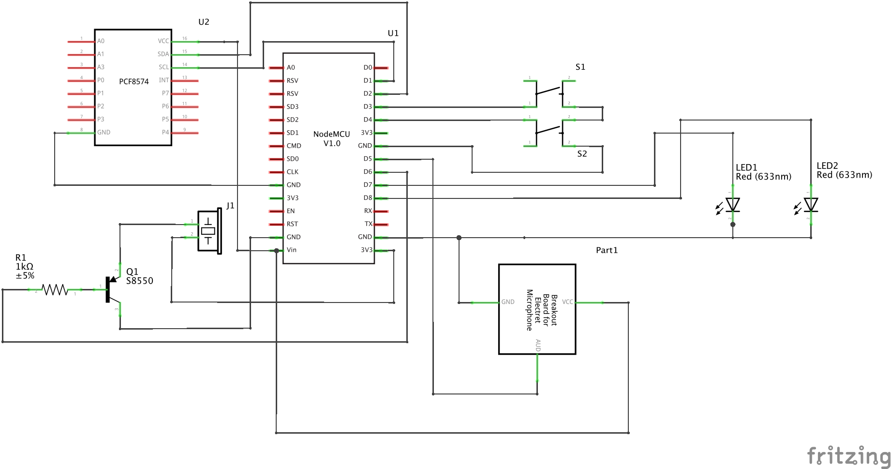

# Arduino Action Air Timer

Competitive shooting measures time taken over the course of fire (COF). A stop
plate is recommended for recording last shot attempted on a COF for airsoft as
shots are not loud enough for consistent microphone pickup.

* Support commercial off the shelf stop plates or PC microphones strapped to a
steel plate.
* Random 1 to 4 seconds delay of start signal after timer trigger.
  * Required by [IPSC rule 8.3.3](https://www.ipsc.org/pdf/RulesAir.pdf).
* **NOT YET IMPLEMENTED** ~~Action camera supporting SJCAM API over Wifi(tested on SJ4000 Wifi), starting
recording at start signal. Kudos to
[the great guide](http://sj4000programming.sourceforge.net).~~
  * ~~Wifi status is shown in smiley or X at the end of first row display.~~
  * ~~See [caveats section](#caveats) below for possible issues.~~

## Hardware
* M5Stack ESP32 Basic Core IoT Development Kit (Other model would likely work as this is Blockly/MicroPython)
* Microphone sound sensor for Arduino.  
  * LM393 using electret microphone with VCC, GND, OUT.  
  * Unsolder electret microphone and replace with mini plug socket for COTS
  stop plate interface.  
**NOT YET IMPLEMENTED, for reference with old design for stop plate interface to NodeMCU**

## Building
* Open uiflow/main.m5f from UIFlow
* Put your M5Stack device under proper mode (e.g. Internet mode or USB mode) for programming
* Hit the "Play" (Right Arrow) button

## Design Notes
* Blockly/MicroPython implementation
* Time for first 20 stop plate hit is displayed TODO: keep most recent 20 hits popping off old entries
* Minimalize global usage, but still unavoidlable in Blockly/MicroPython
  * Globals are accessed by event handlers (e.g. button etc), pretty bad for multithreading but necessary evil the way how Blockly works now. Assuming we don't have this advanced MicroPython enabled yet :) 

## Caveats
* Stop plate is similated by button B now, the gap as-is
  * Stop plate hardware design e.g. the sound sensor design above, or a piezoelectric speaker version to a GPIO on M5Stack IO port
  * Logic to mimic button B handler, may need hystersis logic to debounce the stop plate signal (hint: use event loop and fast periodic timer to poll)
* Basic ESP32 turn out having enough juice with following caveats
  * The countdown screen refresh taken much of CPU load, buttons are less responsive there but we don't care during count down
  * Hence the refresh timer is stopped before start signal beeps, and reenabled with much lower refresh rate so CPU can spend time listen to button or stop plate hit during course of fire